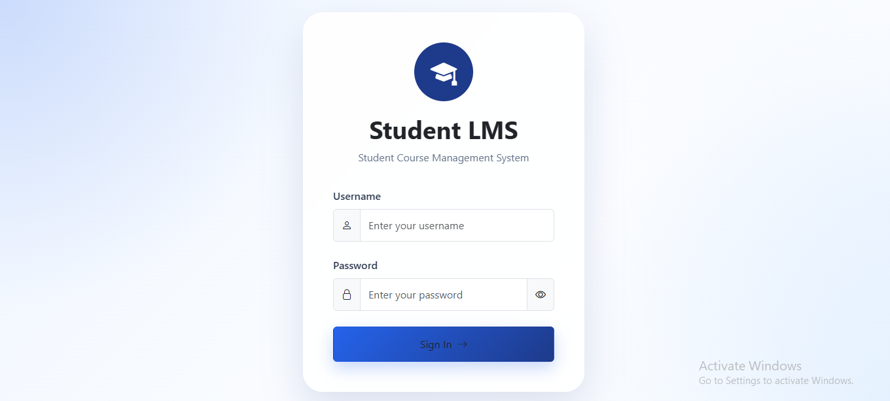
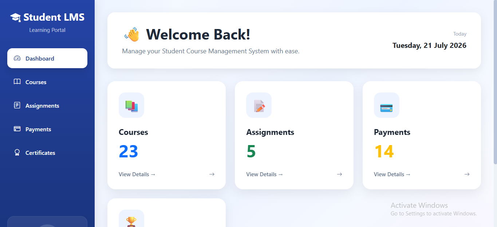
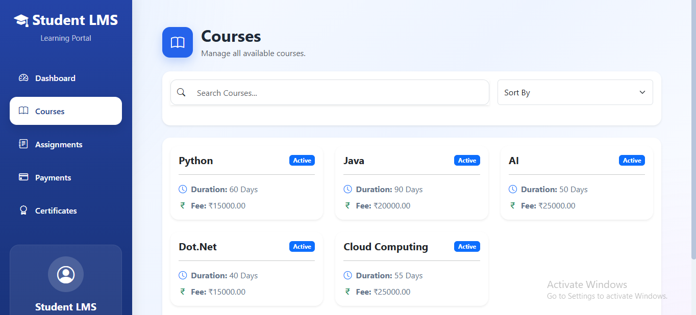
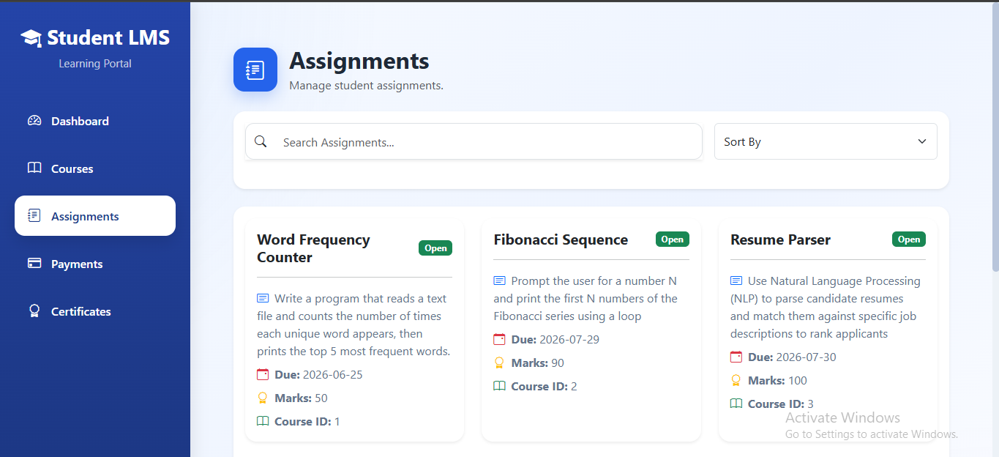
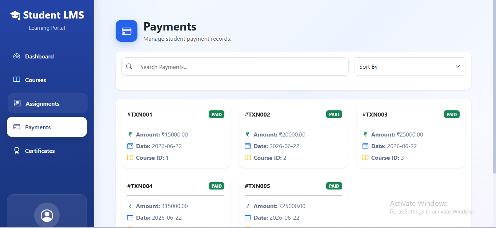
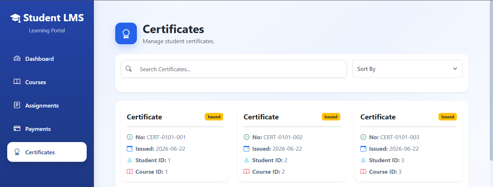

# 🎓 Student Course Management System - Frontend

A modern and responsive frontend for the **Student Course Management System**, built using **React** and **Vite**. The application provides a clean user interface for managing courses, assignments, payments, certificates, and dashboard analytics with secure JWT authentication.

---

## 📸 Application Screenshots

### 🔐 Login Page



---

### 📊 Dashboard



---

### 📚 Courses



---

### 📝 Assignments



---

### 💳 Payments



---

### 🏆 Certificates



---

## ✨ Features

- 🔐 JWT Authentication
- 🛡 Protected Routes
- 📊 Dashboard Statistics
- 📚 Course Management
- 📝 Assignment Management
- 💳 Payment Management
- 🏆 Certificate Management
- 🔍 Search Functionality
- 📑 Sorting
- 📄 Pagination
- 📱 Responsive Design
- 🎨 Modern UI
- ♻️ Reusable Components
- 🔔 Toast Notifications

---

## 🛠 Tech Stack

| Technology | Purpose |
|------------|---------|
| React | Frontend Library |
| Vite | Build Tool |
| React Router DOM | Routing |
| Axios | API Communication |
| Bootstrap 5 | UI Components |
| Bootstrap Icons | Icons |
| React Toastify | Notifications |

---

## 📁 Folder Structure

```text
src/
│
├── components/
├── pages/
├── services/
├── styles/
│
├── App.jsx
├── main.jsx
└── index.css
```

---

## 🚀 Getting Started

### Clone the repository

```bash
git clone <your-frontend-repository-url>
```

### Install dependencies

```bash
npm install
```

### Start development server

```bash
npm run dev
```

---

## 🔐 Authentication

The application uses **JWT Authentication**.

After successful login:

- Access Token is stored in Local Storage
- Refresh Token is stored in Local Storage
- Protected Routes prevent unauthorized access

---

## 📦 Modules

- Login
- Dashboard
- Courses
- Assignments
- Payments
- Certificates

---

## 🎨 UI Highlights

- Modern Login Screen
- Gradient Background
- Dashboard Cards
- Responsive Sidebar
- Search & Sorting
- Pagination
- Smooth Hover Effects
- Consistent Card Design

---

## 🔮 Future Enhancements

- User Profile
- Profile Picture Upload
- Dark Mode
- Charts & Analytics
- Notifications
- Role-Based Authentication

---

## 👨‍💻 Author

**Satya Sindhu**

Python Full Stack Developer